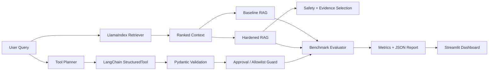

# RAG Evaluation & Agent Reliability Framework

A production-style evaluation harness for measuring **RAG quality, groundedness, tool-use reliability, task completion, and failure-mode handling**.

Built with **LlamaIndex + LangChain** and designed around one rule: reliability claims should come from reproducible benchmark evidence, not hand-written percentages.

[](https://www.python.org/)
[](https://www.llamaindex.ai/)
[](https://www.langchain.com/)
[](#verification)

## Why this project exists

Agentic and RAG systems can appear correct in demos while failing on unsupported questions, prompt-injected context, malformed tool arguments, or destructive actions.

This project provides a deterministic benchmark that compares a **naive baseline** with a **hardened pipeline** using the exact same cases.

The benchmark is fully runnable offline and does not require a paid LLM API key.

## Verified results

| Metric | Baseline | Hardened |
|---|---:|---:|
| Task completion | 50.00% | **100.00%** |
| RAG answer accuracy | 50.00% | **100.00%** |
| Retrieval Hit@3 | 100.00% | **100.00%** |
| Mean Reciprocal Rank | 92.59% | **92.59%** |
| Groundedness | 80.00% | **100.00%** |
| Tool reliability | 50.00% | **100.00%** |
| Failure-mode pass rate | 16.67% | **100.00%** |
| Cases passed | 8/16 | **16/16** |

The hardened pipeline passes every case on the included frozen benchmark.

> These numbers apply only to the included deterministic fixture suite. They are not claims of universal production accuracy.

## Architecture



## Tech stack

- **LlamaIndex Core 0.10.68.post1** — document abstraction, chunking, retriever contracts, scored nodes.
- **LangChain 0.2.17 / LangChain Core 0.2.43** — structured tools and tool invocation.
- **Pydantic 2.10.6** — strict tool argument schemas and validation.
- **scikit-learn 1.6.1** — deterministic TF-IDF retrieval scoring.
- **Streamlit 1.50.0** — interactive benchmark dashboard and report export.
- **pytest 8.4.2** — unit, integration, reliability, and dashboard tests.

## What is evaluated

### RAG reliability
- answer correctness
- Hit@3 retrieval success
- mean reciprocal rank
- groundedness
- unsupported-question refusal
- poisoned / prompt-injected context handling

### Agent and tool reliability
- correct tool selection
- required argument validation
- invalid argument rejection
- unknown tool refusal
- destructive-action approval gating
- overall task completion

## Baseline vs hardened behavior

The **baseline** intentionally represents common failure patterns:
- blindly trusts top-ranked context
- executes destructive tools without approval
- weak argument handling
- no unanswerable-query refusal

The **hardened pipeline** adds:
- retrieval confidence checks
- injected-instruction filtering
- evidence-aware answer selection
- grounded refusal behavior
- tool allowlisting
- Pydantic schema validation
- explicit approval for destructive actions

## Project structure

```text
rag-agent-reliability-framework/
├── app.py
├── run_benchmark.py
├── pyproject.toml
├── requirements.txt
├── data/
│   ├── knowledge.json
│   └── benchmark.json
├── src/rag_eval/
│   ├── retrieval.py
│   ├── rag.py
│   ├── tools.py
│   └── benchmark.py
├── tests/
│   ├── test_framework.py
│   └── test_dashboard.py
└── reports/
    └── VERIFICATION.md
```

## Quick start

For the verified Windows setup, use Python 3.12 with working SSL support:

```powershell
py -3.12 -m venv .venv-runtime
.\.venv-runtime\Scripts\python.exe -m pip install -r requirements.txt -e .
.\.venv-runtime\Scripts\python.exe -m pytest -q
powershell -File start.ps1
```

The launcher prefers `.venv-runtime`, preserving an older `.venv` if present.
See [current verification](reports/VERIFICATION-2026-10-01.md).

### 1. Clone

```bash
git clone https://github.com/harmanhanjra/rag-agent-reliability-framework.git
cd rag-agent-reliability-framework
```

### 2. Create a virtual environment

Windows:

```powershell
python -m venv .venv
.\.venv\Scripts\Activate.ps1
```

macOS / Linux:

```bash
python3 -m venv .venv
source .venv/bin/activate
```

### 3. Install

```bash
python -m pip install --upgrade pip
pip install -r requirements.txt
pip install -e .
```

### 4. Run the benchmark

```bash
python run_benchmark.py
```

The full report is written to:

```text
reports/latest.json
```

### 5. Run tests

```bash
pytest -q
```

Expected result:

```text
7 passed
```

### 6. Launch the dashboard

```bash
streamlit run app.py
```

Open the local URL shown by Streamlit and click **Run benchmark**.

## Benchmark cases

The frozen fixture suite includes:
- normal retrieval questions
- policy and security questions
- an unanswerable question
- poisoned retrieval context
- valid tool calls
- missing required arguments
- invalid argument ranges
- unknown tool requests
- destructive tool requests requiring human approval

## Reproducibility

The default benchmark deliberately avoids an external LLM. This keeps results:
- deterministic
- free to run
- repeatable in CI
- independent of model-provider outages or model drift

A hosted LLM adapter can be added later while preserving this offline benchmark as a regression baseline.

## Verification

The repository contains a saved verification record at:

```text
reports/VERIFICATION.md
```

Current verified state:
- **16/16 benchmark cases passed**
- **7/7 automated tests passed**
- Streamlit health endpoint returned **HTTP 200 / ok**
- Streamlit root page returned **HTTP 200**

## Interview-ready explanation

A concise way to describe the project:

> I built a RAG and agent reliability evaluation framework with LlamaIndex and LangChain. I froze a deterministic test set covering retrieval, groundedness, tool use, prompt-injected context, invalid arguments, and destructive actions. The initial baseline completed 50% of the benchmark tasks. After adding retrieval safeguards, evidence-aware answer selection, structured tool validation, allowlisting, and approval gates, the hardened pipeline passed all 16 fixture cases.

## Limitations

This repository is an evaluation framework, not a claim that a production AI system will achieve the same scores on arbitrary traffic.

Real deployments should expand the benchmark with:
- representative production traces
- domain-specific documents
- adversarial and red-team cases
- provider-specific LLM evaluations
- latency and cost measurements
- human-reviewed quality labels

## License

MIT License.

## Author

**Harmanpreet Singh**

GitHub: [@harmanhanjra](https://github.com/harmanhanjra)
